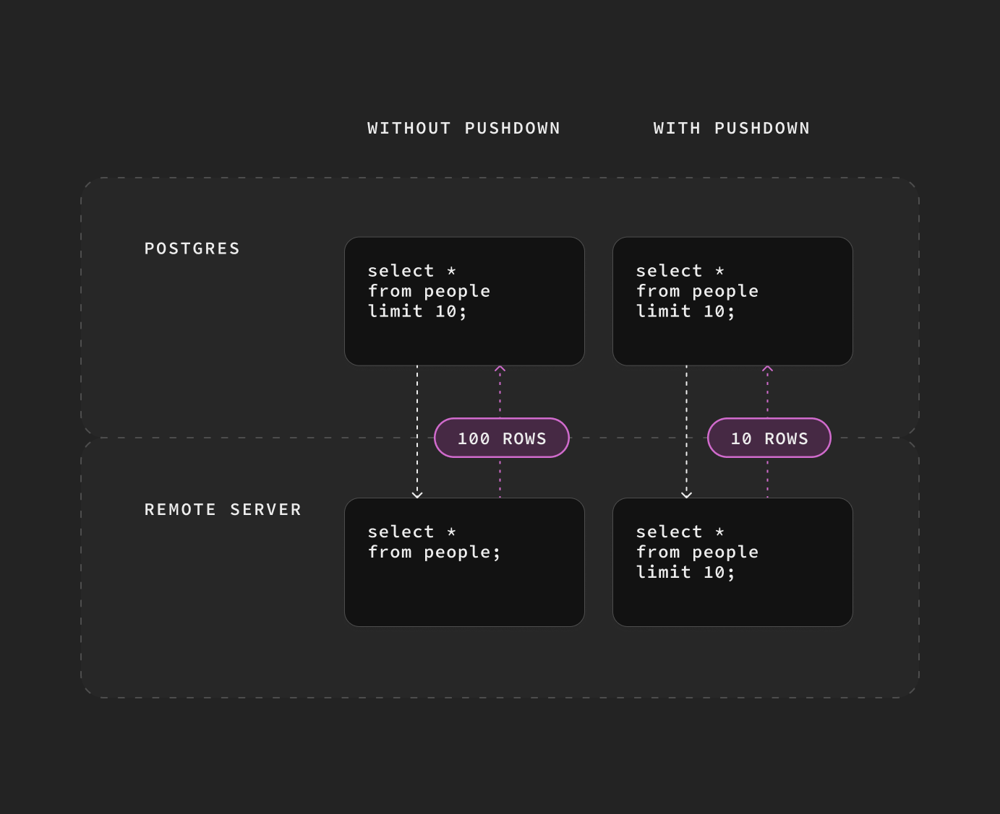

# Query Pushdown

Query pushdown is a technique that enhances query performance by executing parts of the query directly on the data source. It reduces data transfer between the database and the application, enabling faster execution and improved performance.

### What is Query Pushdown?

Query pushdown is a technique that enhances query performance by executing parts of the query directly on the data source. It reduces data transfer between the database and the application, enabling faster execution and improved performance.



### Using Query Pushdown

In Wrappers, the pushdown logic is integrated into each FDW. You don’t need to modify your queries to benefit from this feature. For example, the [Stripe FDW](https://supabase.com/docs/guides/database/extensions/wrappers/stripe) automatically applies query pushdown for `id` within the `customer` object:

```sql
select *
from stripe.customers
where id = 'cus_N5WMk7pvQPkY3B';
```

This approach contrasts with fetching and filtering all customers locally, which is less efficient. Query pushdown translates this into a single API call, significantly speeding up the process:

```bash
https://api.stripe.com/v1/customers/cus_N5WMk7pvQPkY3B
```

We can use push down criteria and other query parameters too. For example, [ClickHouse FDW](https://supabase.com/docs/guides/database/extensions/wrappers/clickhouse) supports `order by` and `limit` pushdown:

```sql
select *
from clickhouse.people
order by name
limit 20;
```

This query executes `order by name limit 20` on ClickHouse before transferring the result to Postgres.
